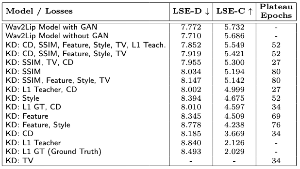
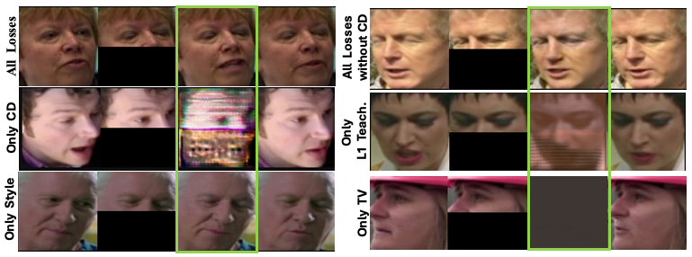

# Wav2Lip Knowledge Distillation

This repository extends the original [Wav2Lip](https://github.com/Rudrabha/Wav2Lip) speech to lip sync model with knowledge distillation. This work investigates how different loss terms affect the training and output of a smaller student model using a larger, frozen pretrained Wav2Lip GAN teacher, with the goal of maintaining lip sync quality while reducing model size.

## Overview

This work modifies the original Wav2Lip training and inference pipeline to support teacher–student distillation experiments. The student model is trained from a pretrained, frozen Wav2Lip GAN teacher by combining multiple distillation losses on top of the sync loss to transfer both output behavior and intermediate feature information. The GAN model was chosen as the teacher because of its superior visual quality. To understand which of the KD losses had the greatest effect, all hyperparameters were kept constant and only the weight of each loss was changed to determine whether that loss was included in a given experiment.

### Distillation Losses

- **Channel distillation:** Transfers intermediate decoder feature channels from the teacher to the student to encourage similar internal representations.
- **SSIM loss:** Encourages local structural similarity between teacher and student outputs by comparing luminance, contrast, and structure. It is sensitive to local structural changes and mimics human perception.
- **Feature loss:** Minimizes the L1 difference between the activations of specific layers in a pretrained VGG network. This is encouraging the student’s output to be perceptually similar to the teacher’s.
- **Style loss:** Compares the L1 loss of Gram matrices for the same VGG features. It encourages similarity in style characteristics such as color and textures.
- **Total variation (TV) loss:** Measures the internal variation of an image to reduce noise.  On its own it will encourage all pixels to be the same and will result in a gray image with no face.
- **L1 loss to ground truth:** Compares the student’s output directly to the ground truth with an L1 loss.
- **L1 loss to teacher output:** Compares the student’s output to the teacher’s output with an L1 loss.

The work draws on compression and distillation ideas from [A Unified Compression Framework for Efficient Speech-Driven Talking-Face Generation](https://arxiv.org/abs/2304.00471) and uses the [OMGD repository](https://github.com/bytedance/OMGD/tree/f2492a449498e6b88289666b02ddc47b2296465c) as a reference for implementing losses described in [Online Multi-Granularity Distillation for GAN Compression](https://arxiv.org/abs/2108.06908).


### Evaluation Metrics

The two main benchmarks used in this work, LSE-D and LSE-C, were introduced by the original Wav2Lip work.

- **LSE-D (LipSyncError Distance):** Measures the average error between generated and ground truth lip movements for a given audio file. A lower value indicates better sync between lip movements and speech.
- **LSE-C (LipSyncError Confidence):** Measures audio video alignment confidence. A higher value corresponds to more realistic lip movements.


### Results Highlights

The knowledge distillation setup successfully transferred knowledge from the Wav2Lip GAN teacher to a smaller student model, achieving comparable lip sync quality with far fewer training epochs when multiple loss terms were combined. These student models were trained for 80 epochs, compared to the teacher model which was trained for 300 epochs.

#### Quantitative Metrics

<p align="center">
  
</p>

The table above summarizes student models trained with different combinations of KD losses against the pretrained Wav2Lip models from the original [Wav2Lip work](https://github.com/Rudrabha/Wav2Lip). Each row reports LSE-D (lower is better), LSE-C (higher is better), and the epoch where validation loss plateaued. Configurations that combined channel distillation with SSIM, feature, style, and TV losses achieved stronger lip sync metrics than single loss models. All KD models include the sync loss, and the Wav2Lip model with GAN was used as the KD teacher model.

#### Model outputs at 80 epochs

<p align="center">
  
</p>

#### Multi Loss Wins

The best results came from **combining multiple losses together**. Models trained with channel distillation + SSIM + feature + style + TV losses achieved the strongest lip sync metrics (LSE-D and LSE-C scores).

Sample frames comparing student outputs at 80 epochs showed that the full multi loss knowledge distillation setup produced faces that were structurally and texturally closer to the teacher outputs. For the better performing models, visual differences between student and teacher outputs were often subtle, suggesting that a more challenging dataset could better highlight the effects of different loss combinations.

#### Single Losses Fall Short

When tested individually, single loss student models consistently struggled and produced visible defects:

- **Channel distillation alone:** Failed to produce recognizable faces without output level guidance. Although it helps the student match the teacher's intermediate decoder feature channels and improves LSE-D/LSE-C when combined with other losses, it does not produce reasonable output faces on its own.

- **Style loss alone:** Created a light hatched pattern near the top of the face.

- **TV loss alone:** Drove the image toward a nearly uniform gray face, destroying facial features and leaving no meaningful face to evaluate with LSE-D or LSE-C. This suggests TV loss is more useful as a supporting loss than as a standalone objective.

- **L1 to teacher or Ground Truth only:** Produced unstable training curves that bounced rather than decreased, indicating that L1 alone was not a sufficient learning signal. These configurations also underperformed visually.


## What I Changed

### Training Infrastructure Changes for Simultaneous Experiments

These changes were made primarily to support running multiple experiment configurations in parallel from a single codebase by selecting different hyperparameter objects from `hparams.py`. This makes it easier to run and track experiments with different loss settings or hyperparameter configurations in parallel.

- Updated training files (`wav2lip_train.py`, `hq_wav2lip_train.py`, `wav2lip_train_student.py`) and `audio.py` to load specified `hparam` objects from `hparams.py`, enabling running of a configuration without code changes.
- Updated `hparams.py` to print and save a JSON snapshot of the selected `hparam` configuration for each training run, making experiments easier to track and reproduce.
- Modified the training files to log all training and validation losses, generate loss plots, and save plots and metrics at every checkpoint so parallel runs can be compared consistently.
- Added logic to `wav2lip_train_student.py` to compute each loss only when its corresponding weight in `hparams.py` is nonzero, allowing different loss configurations across simultaneous experiments.

### Knowledge Distillation Changes

- Implemented a student model, trained from a pretrained Wav2Lip GAN teacher, based on the compression framework described in [A Unified Compression Framework for Efficient Speech-Driven Talking-Face Generation](https://arxiv.org/abs/2304.00471).
- Added intermediate student and teacher feature extraction in `wav2lip.py` to support channel distillation.
- Added channel distillation, TV, SSIM, style, and feature losses in `wav2lip_train_student.py` by using the [OMGD repository](https://github.com/bytedance/OMGD/tree/f2492a449498e6b88289666b02ddc47b2296465c) as a reference.


## Dataset

This work uses the [Oxford-BBC Lip Reading Sentences 2 (LRS2)](https://www.robots.ox.ac.uk/~vgg/data/lip_reading/lrs2.html) dataset, which is also the dataset referenced by the original Wav2Lip training pipeline. For dataset details, see [Deep Audio-Visual Speech Recognition](https://arxiv.org/abs/1809.02108).

## Installation and Original Project

This repository is based on the original [Wav2Lip repository](https://github.com/Rudrabha/Wav2Lip). For environment setup, dependency installation, pretrained models, and baseline training or inference instructions, please refer to the upstream Wav2Lip repository.

My modifications were developed and tested with Python 3.8, and the package versions used for this work are listed in `requirements.txt` in this repository.


## Training

Use the modified training pipeline to run student-model experiments with selected hyperparameter objects from `hparams.py`.

Example workflow:

```bash
python wav2lip_train_student.py \
  --checkpoint_dir <checkpoint_dir> \
  --hparams_config <hparams_config> \
  --teacher_checkpoint_path <teacher_checkpoint_path> \
  --data_root <data_root> \
  --syncnet_checkpoint_path <syncnet_checkpoint_path>
```


## Inference

After training, run inference with the student model using:

```bash
python inference_student.py \
  --checkpoint_path <ckpt> \
  --hparams_config <hparams_config> \
  --face <video.mp4> \
  --audio <an-audio-source>
```

## References

- Wav2Lip paper: [A Lip Sync Expert Is All You Need for Speech to Lip Generation In the Wild](https://arxiv.org/abs/2008.10010)
- Wav2Lip implementation: [Wav2Lip repository](https://github.com/Rudrabha/Wav2Lip)
- Knowledge distillation paper: [A Unified Compression Framework for Efficient Speech-Driven Talking-Face Generation](https://arxiv.org/abs/2304.00471)
- Losses paper: [Online Multi-Granularity Distillation for GAN Compression](https://arxiv.org/abs/2108.06908)
- Losses implementation: [OMGD GitHub repository](https://github.com/bytedance/OMGD/tree/f2492a449498e6b88289666b02ddc47b2296465c)
- Dataset page: [The Oxford-BBC Lip Reading Sentences 2 (LRS2)](https://www.robots.ox.ac.uk/~vgg/data/lip_reading/lrs2.html)
- Dataset paper: [Lip Reading Sentences in the Wild](https://arxiv.org/abs/1809.02108)

## Usage Notice

This repository is shared for portfolio, research, and educational purposes. The original Wav2Lip open-source repository states that the code is for personal, research, and non-commercial use only, and that restriction should be observed here as well.
